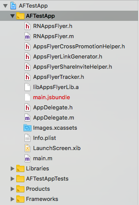

# Adding   react-native-appsflyer to your project

- Installation using CLI
  - [Installation with autolinking](#Installation-with-autolinking)
  - [Installation without autolinking](#Installation-without-autolinking)
- Manual installation
  - [iOS](#manual-installation-ios)
  - [Android](#manual-installation-android)
- Add strict-mode for App-kids
- The AD_ID permission for android apps

## <a id="Installation-with-autolinking"> Installation (with [autolinking](https://github.com/react-native-community/cli/blob/master/docs/autolinking.md))

Run the following:
  
```
$ npm install react-native-appsflyer --save
$ cd ios && pod install
```

## <a id="Installation-without-autolinking"> Installation (without [autolinking](https://github.com/react-native-community/cli/blob/master/docs/autolinking.md))
  
  
  Run the following:
  
```
$ npm install react-native-appsflyer --save
$ react-native link react-native-appsflyer
```


### <a id="manual-installation-ios"> iOS


1. Add the `appsFlyerFramework` to `podfile` and run `pod install`.


Example:

```
pod 'react-native-appsflyer',
:path => '../node_modules/react-native-appsflyer'
```

This assumes your `Podfile` is located in `ios` directory.

#### <a id="sample_podfile"> Sample pod file:
```
target 'AFTest' do

  pod 'React', :path => '../node_modules/react-native', :subspecs => [
    'Core',
    'CxxBridge', # Include this for RN >= 0.47
    'DevSupport', # Include this to enable In-App Devmenu if RN >= 0.43
    'RCTText',
    'RCTNetwork',
    'RCTWebSocket', # Needed for debugging
    'RCTAnimation', # Needed for FlatList and animations running on native UI thread
    # Add any other subspecs you want to use in your project
  ]

  pod 'yoga', :path => '../node_modules/react-native/ReactCommon/yoga'

  pod 'react-native-appsflyer',
  :path => '../node_modules/react-native-appsflyer'


  pod 'DoubleConversion', :podspec => '../node_modules/react-native/third-party-podspecs/DoubleConversion.podspec'
  pod 'glog', :podspec => '../node_modules/react-native/third-party-podspecs/glog.podspec'
  pod 'Folly', :podspec => '../node_modules/react-native/third-party-podspecs/Folly.podspec'


end
```

2. Run `pod install` (inside `ios` directory).

### Manual Integration (Integrating without Cocoapods):

1. Download the Static Lib of the AppsFlyer iOS SDK from [AppsFlyer devHub](https://dev.appsflyer.com/hc/docs/install-ios-sdk#manual-install)
2. Unzip and copy the contents of the Zip file into your project directory
3. Run `react-native link react-native-appsflyer` from of the project root or copy RNAppsFlyer.h and RNAppsFlyer.m from `node_modules` ➜ `react-native-appsflyer` to your project directory




### <a id="manual-installation-android"> Android
  
Run `react-native link react-native-appsflyer` OR add manually:

##### **android/app/build.gradle**

Add the project to your dependencies
```gradle
dependencies {
...
compile project(':react-native-appsflyer')
}
```

##### **android/settings.gradle**

Add the project

```gradle
include ':react-native-appsflyer'
project(':react-native-appsflyer').projectDir = new File(rootProject.projectDir, '../node_modules/react-native-appsflyer/android')
```

If you need to override sdk version, add custom configuration to your root gradle, for example:

```gradle
ext {
    minSdkVersion = 16
    targetSdkVersion = 25
    compileSdkVersion = 25
    buildToolsVersion = '25.0.3'
}
```

##### **MainApplication.java**
Add:


1. `import com.appsflyer.reactnative.RNAppsFlyerPackage;`

2.  In the `getPackages()` method register the module:
`new RNAppsFlyerPackage()`

So `getPackages()` should look like:

```java
    @Override
    protected List<ReactPackage> getPackages() {
      return Arrays.<ReactPackage>asList(
            new MainReactPackage(),
            //...
            new RNAppsFlyerPackage()
            //...
      );
    }
```

## Add strict-mode for App-kids
Starting from version **6.1.10** iOS SDK comes in two variants: **Strict** mode and **Regular** mode. Please read more [here](https://dev.appsflyer.com/hc/docs/install-ios-sdk#strict-mode-sdk)<br>

***Change to Strict mode***<br>
After you installed the AppsFlyer plugin, add `$RNAppsFlyerStrictMode=true` in the project's Podfile:
```
//MyRNApp/ios/Podfile
...
use_frameworks!
  $RNAppsFlyerStrictMode=true

  # Pods for MyRNApp
...

```
In the `ios` folder of your `root` project Run `pod install`

***Change to Regular mode***<br>
Remove `$RNAppsFlyerStrictMode=true` from the project's Podfile or set it to `false`:
```
//MyRNApp/ios/Podfile
...
use_frameworks!
  $RNAppsFlyerStrictMode=false //OR remove this line

  # Pods for MyRNApp
...
```
In the `ios` folder of your `root` project Run `pod install`

## The AD_ID permission for android apps
In v6.8.0 of the AppsFlyer SDK, we added the normal permission com.google.android.gms.permission.AD_ID to the SDK's AndroidManifest, 
to allow the SDK to collect the Android Advertising ID on apps targeting API 33.
If your app is targeting children, you need to revoke this permission to comply with Google's Data policy.
You can read more about it here [here](https://dev.appsflyer.com/hc/docs/install-android-sdk#the-ad_id-permission)
